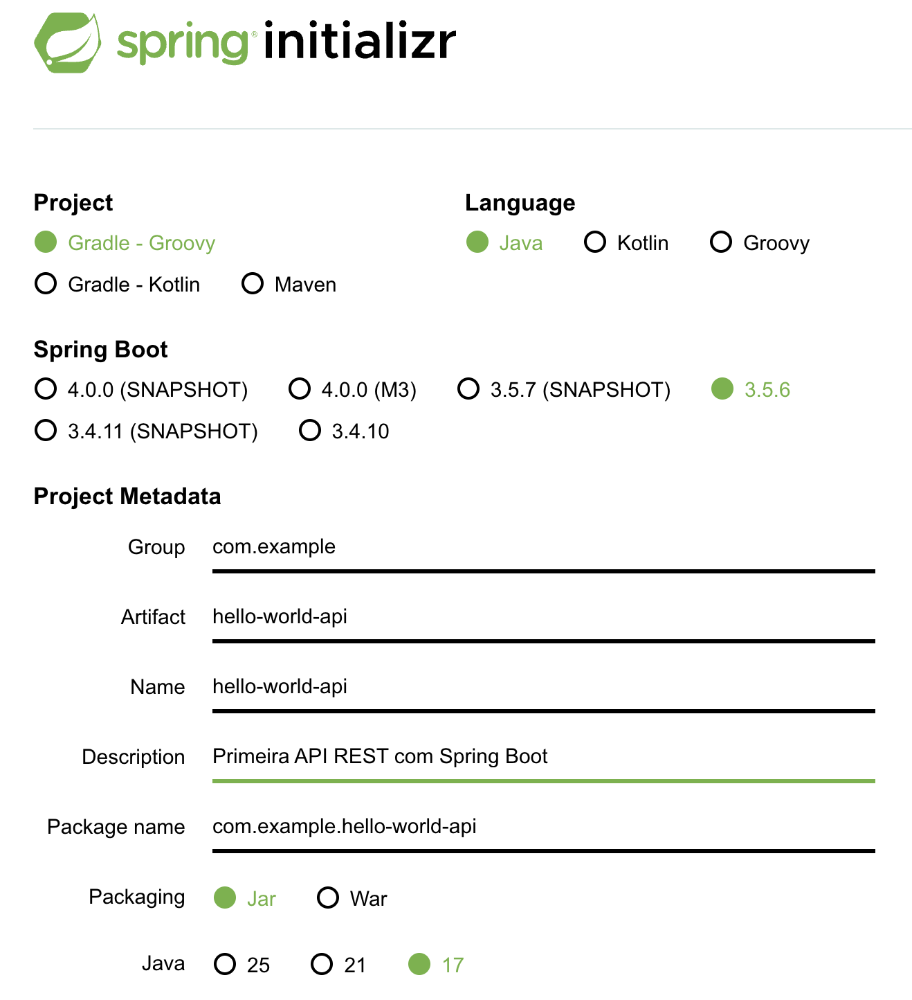

<div  align="center">
    
    <h1> Introdução ao Spring Boot e Configuração do Ambiente </h1>
</div>

## 📋 Índice

1. [Objetivos da Aula](#objetivos-da-aula)
2. [O que é Spring Boot?](#o-que-é-spring-boot)
3. [Instalação do Java JDK](#instalação-do-java-jdk)
4. [Instalação do Maven/Gradle](#instalação-do-mavengradle)
5. [Criação de Projeto com Spring Initializr](#criação-de-projeto-com-spring-initializr)
6. [Estrutura de um Projeto Spring Boot](#estrutura-de-um-projeto-spring-boot)
7. [Primeira Aplicação "Hello World"](#primeira-aplicação-hello-world)
8. [Executando a Aplicação](#executando-a-aplicação)
9. [Exercícios Práticos](#exercícios-práticos)
10. [Recursos Adicionais](#recursos-adicionais)

---

## 🎯 Objetivos da Aula

Ao final desta aula, você será capaz de:

- ✅ Compreender o que é Spring Boot e suas vantagens
- ✅ Instalar e configurar o ambiente de desenvolvimento Java
- ✅ Criar um projeto Spring Boot utilizando o Spring Initializr
- ✅ Entender a estrutura de pastas e arquivos de um projeto Spring Boot
- ✅ Desenvolver e executar sua primeira aplicação REST "Hello World"

---

## 🌱 O que é Spring Boot?

**Spring Boot** é um framework Java que simplifica o desenvolvimento de aplicações baseadas no Spring Framework. Ele fornece:

### Principais Características

- **Configuração Automática**: Reduz drasticamente a necessidade de configuração manual
- **Servidores Embarcados**: Tomcat, Jetty ou Undertow embutidos (não precisa de servidor externo)
- **Starters**: Dependências pré-configuradas para diferentes funcionalidades
- **Sem Geração de Código**: Não gera código, apenas configuração
- **Sem XML**: Configuração baseada em anotações Java

### Por que usar Spring Boot?

- 🚀 **Rápido**: Crie aplicações para produção rapidamente
- 📦 **Convenção sobre Configuração**: Padrões que funcionam imediatamente
- 🔧 **Fácil Manutenção**: Estrutura organizada e padronizada


---

## ☕ Instalação do Java JDK

### Passo 1: Verificar se o Java já está instalado

Abra o terminal e execute:

```bash
java -version
```

Se o Java estiver instalado, você verá a versão. Caso contrário, siga para a instalação.

### Passo 2: Download do JDK

**Recomendação**: Use Java 17 LTS ou Java 21 LTS (versões Long-Term Support)

#### Opções de Download:

1. **Oracle JDK**: [https://www.oracle.com/java/technologies/downloads/](https://www.oracle.com/java/technologies/downloads/)
2. **OpenJDK**: [https://adoptium.net/](https://adoptium.net/) (Eclipse Temurin - recomendado)
3. **Amazon Corretto**: [https://aws.amazon.com/corretto/](https://aws.amazon.com/corretto/)

### Passo 3: Instalação

#### macOS
```bash
# Usando Homebrew
brew install openjdk@17

# Adicionar ao PATH (adicione ao ~/.zshrc ou ~/.bash_profile)
echo 'export PATH="/opt/homebrew/opt/openjdk@17/bin:$PATH"' >> ~/.zshrc
source ~/.zshrc
```

#### Linux (Ubuntu/Debian)
```bash
sudo apt update
sudo apt install openjdk-17-jdk

# Verificar instalação
java -version
javac -version
```

#### Windows
1. Baixe o instalador `.exe` ou `.msi`
2. Execute o instalador e siga as instruções
3. Configure a variável de ambiente `JAVA_HOME`:
   - Acesse: Painel de Controle → Sistema → Configurações Avançadas → Variáveis de Ambiente
   - Crie `JAVA_HOME` apontando para o diretório de instalação (ex: `C:\Program Files\Java\jdk-17`)
   - Adicione `%JAVA_HOME%\bin` ao `PATH`


### Passo 4: Verificar Instalação

```bash
java -version
javac -version
echo $JAVA_HOME  # Linux/macOS
echo %JAVA_HOME%  # Windows
```

---

## 🔨 Instalação do Maven/Gradle

### Maven

Maven é uma ferramenta de automação e gerenciamento de projetos Java.

#### Windows
1. Baixe o Maven: [https://maven.apache.org/download.cgi](https://maven.apache.org/download.cgi)
2. Extraia o arquivo ZIP em um diretório (ex: `C:\Program Files\Apache\maven`)
3. Configure as variáveis de ambiente:
   - `MAVEN_HOME`: diretório de instalação
   - Adicione `%MAVEN_HOME%\bin` ao `PATH`

#### macOS
```bash
brew install maven
```

#### Linux
```bash
sudo apt update
sudo apt install maven
```

#### Verificar Instalação
```bash
mvn -version
```

### Gradle (Alternativa ao Maven)

#### Windows/macOS/Linux
```bash
# Usando SDKMAN (recomendado)
curl -s "https://get.sdkman.io" | bash
source "$HOME/.sdkman/bin/sdkman-init.sh"
sdk install gradle

# Ou usando Homebrew (macOS)
brew install gradle
```

#### Verificar Instalação
```bash
gradle -version
```

---

## 🚀 Criação de Projeto com Spring Initializr

O **Spring Initializr** é uma ferramenta web que gera a estrutura inicial de projetos Spring Boot.

### Método 1: Usando o Site (Recomendado para Iniciantes)

1. Acesse: [https://start.spring.io/](https://start.spring.io/)

2. **Configure o Projeto**:
   - **Project**: Maven ou Gradle
   - **Language**: Java
   - **Spring Boot**: 3.x.x (versão estável mais recente)
   - **Project Metadata**:
     - Group: `com.exemplo` (seu domínio invertido)
     - Artifact: `hello-world-api`
     - Name: `hello-world-api`
     - Description: `Primeira API REST com Spring Boot`
     - Package name: `com.exemplo.helloworldapi`
     - Packaging: **Jar**
     - Java: **17** ou **21**

<div align="center">
    
    <p><i>Interface do Spring Initializr para configuração do projeto</i></p>
</div>

3. **Adicione Dependências**:
   - **Spring Web**: Para criar APIs REST
   - **Spring Boot DevTools**: Para hot reload durante desenvolvimento (opcional)

4. Clique em **GENERATE** para baixar o projeto como ZIP

5. Extraia o arquivo e abra no seu IDE favorito (VS Code, Eclipse, etc..)

### Método 2: Usando a CLI do Spring Boot

```bash 
# Instalar Spring Boot CLI
brew tap spring-io/tap
brew install spring-boot

# Criar projeto
spring init --dependencies=web --name=hello-world-api --group-id=com.exemplo --artifact-id=hello-world-api hello-world-api

cd hello-world-api
```


---

## 📁 Estrutura de um Projeto Spring Boot

Após gerar o projeto, você terá a seguinte estrutura:

```
hello-world-api/
│
├── src/
│   ├── main/
│   │   ├── java/
│   │   │   └── com/
│   │   │       └── exemplo/
│   │   │           └── helloworldapi/
│   │   │               └── HelloWorldApiApplication.java  # Classe principal
│   │   └── resources/
│   │       ├── application.properties  # Configurações da aplicação
│   │       ├── static/                 # Arquivos estáticos (HTML, CSS, JS)
│   │       └── templates/              # Templates (Thymeleaf, etc)
│   │
│   └── test/
│       └── java/
│           └── com/
│               └── exemplo/
│                   └── helloworldapi/
│                       └── HelloWorldApiApplicationTests.java  # Testes
│
├── target/                  # Arquivos compilados (gerado pelo Maven)
├── .gitignore              # Arquivos ignorados pelo Git
├── mvnw                    # Maven Wrapper (Unix)
├── mvnw.cmd                # Maven Wrapper (Windows)
├── pom.xml                 # Configuração do Maven (dependências, plugins)
└── README.md               # Documentação do projeto
```

### Principais Arquivos

#### 1. `pom.xml` (Maven) ou `build.gradle` (Gradle)

Arquivo de configuração do projeto, onde definimos:
- Dependências (bibliotecas)
- Plugins
- Versão do Java
- Configurações de build

**Exemplo de `pom.xml`**:
```xml
<?xml version="1.0" encoding="UTF-8"?>
<project xmlns="http://maven.apache.org/POM/4.0.0" 
         xmlns:xsi="http://www.w3.org/2001/XMLSchema-instance"
         xsi:schemaLocation="http://maven.apache.org/POM/4.0.0 
         https://maven.apache.org/xsd/maven-4.0.0.xsd">
    <modelVersion>4.0.0</modelVersion>
    
    <parent>
        <groupId>org.springframework.boot</groupId>
        <artifactId>spring-boot-starter-parent</artifactId>
        <version>3.2.0</version>
        <relativePath/>
    </parent>
    
    <groupId>com.exemplo</groupId>
    <artifactId>hello-world-api</artifactId>
    <version>0.0.1-SNAPSHOT</version>
    <name>hello-world-api</name>
    <description>Primeira API REST com Spring Boot</description>
    
    <properties>
        <java.version>17</java.version>
    </properties>
    
    <dependencies>
        <dependency>
            <groupId>org.springframework.boot</groupId>
            <artifactId>spring-boot-starter-web</artifactId>
        </dependency>
        
        <dependency>
            <groupId>org.springframework.boot</groupId>
            <artifactId>spring-boot-starter-test</artifactId>
            <scope>test</scope>
        </dependency>
    </dependencies>
    
    <build>
        <plugins>
            <plugin>
                <groupId>org.springframework.boot</groupId>
                <artifactId>spring-boot-maven-plugin</artifactId>
            </plugin>
        </plugins>
    </build>
</project>
```

#### 2. `HelloWorldApiApplication.java` - Classe Principal

```java
package com.example.hello_world_api;

import org.springframework.boot.SpringApplication;
import org.springframework.boot.autoconfigure.SpringBootApplication;

@SpringBootApplication
public class HelloWorldApiApplication {

	public static void main(String[] args) {
		SpringApplication.run(HelloWorldApiApplication.class, args);
	}

}
```

**Explicação**:
- `@SpringBootApplication`: Combina três anotações importantes:
  - `@Configuration`: Marca a classe como fonte de configurações
  - `@EnableAutoConfiguration`: Ativa a configuração automática
  - `@ComponentScan`: Escaneia componentes no pacote e subpacotes

#### 3. `application.properties`

Arquivo de configuração da aplicação:

```properties
# Porta do servidor (padrão: 8080)
server.port=8080

# Nome da aplicação
spring.application.name=hello-world-api

# Log level
logging.level.root=INFO
```

---

## 👋 Primeira Aplicação "Hello World"

Vamos criar nossa primeira API REST que retorna "Hello World"!

### Passo 1: Criar um Controller

Crie um novo pacote `controller` dentro de `com.exemplo.helloworldapi` e adicione a classe `HelloController.java`:

```java
package com.exemplo.helloworldapi.controller;

import com.example.hello_world_api.model.HelloResponse;
import org.springframework.web.bind.annotation.GetMapping;
import org.springframework.web.bind.annotation.RequestMapping;
import org.springframework.web.bind.annotation.RestController;

@RestController
@RequestMapping("/api")
public class HelloController {

    @GetMapping("/hello")
    public String hello() {
        return "Hello World! Bem-vindo ao Spring Boot!";
    }
    
    @GetMapping("/hello/json")
    public HelloResponse helloJson() {
        return new HelloResponse("Hello World!", "Primeira API REST com Spring Boot");
    }
}
```

### Passo 2: Criar uma Classe de Resposta (opcional)

Crie um pacote `model` e adicione `HelloResponse.java`:

```java
package com.exemplo.helloworldapi.model;

public class HelloResponse {
    
    private String mensagem;
    private String descricao;
    
    // Construtores
    public HelloResponse() {
    }
    
    public HelloResponse(String mensagem, String descricao) {
        this.mensagem = mensagem;
        this.descricao = descricao;
    }
    
    // Getters e Setters
    public String getMensagem() {
        return mensagem;
    }
    
    public void setMensagem(String mensagem) {
        this.mensagem = mensagem;
    }
    
    public String getDescricao() {
        return descricao;
    }
    
    public void setDescricao(String descricao) {
        this.descricao = descricao;
    }
}
```

### Explicação das Anotações

- **`@RestController`**: Indica que a classe é um controller REST. Combina `@Controller` + `@ResponseBody`
- **`@RequestMapping("/api")`**: Define o caminho base para todos os endpoints desta classe
- **`@GetMapping("/hello")`**: Mapeia requisições HTTP GET para o método específico
- **Retorno Automático em JSON**: Spring Boot converte automaticamente objetos Java em JSON

---

## ▶️ Executando a Aplicação

### Método 1: Pela IDE

- **VS Code**: Use a extensão Spring Boot Dashboard
- **Eclipse**: Clique com o botão direito no projeto → Run As → Spring Boot App


### Método 2: Pelo Terminal

```bash
# Usando Maven
./mvnw spring-boot:run

# Ou no Windows
mvnw.cmd spring-boot:run

# Usando Gradle
./gradlew bootRun
```

### Método 3: Gerando JAR Executável

```bash
# Compilar e gerar JAR
./mvnw clean package

# Executar o JAR
java -jar target/hello-world-api-0.0.1-SNAPSHOT.jar
```

### Testando a Aplicação

Após iniciar, você verá logs no console indicando que a aplicação está rodando na porta 8080.

#### Usando o Navegador

Acesse: [http://localhost:8080/api/hello](http://localhost:8080/api/hello)

Você verá: `Hello World! Bem-vindo ao Spring Boot!`

Acesse: [http://localhost:8080/api/hello/json](http://localhost:8080/api/hello/json)

Você verá:
```json
{
  "mensagem": "Hello World!",
  "descricao": "Primeira API REST com Spring Boot"
}
```

#### Usando cURL (Terminal)

```bash
curl http://localhost:8080/api/hello

curl http://localhost:8080/api/hello/json
```

#### Usando Postman

1. Crie uma nova requisição GET
2. URL: `http://localhost:8080/api/hello`
3. Envie a requisição
4. Observe a resposta

---

## 📝 Exercícios Práticos

### Exercício 1: Novo Endpoint
Crie um endpoint `/api/info` que retorne informações sobre você (nome, curso, universidade) em formato JSON.

### Exercício 2: Endpoint com Parâmetro
Crie um endpoint `/api/saudacao/{nome}` que receba um nome na URL e retorne "Olá, {nome}!".

**Dica**: Use `@PathVariable`

```java
@GetMapping("/saudacao/{nome}")
public String saudacao(@PathVariable String nome) {
    return "Olá, " + nome + "!";
}
```

### Exercício 3: Endpoint com Query Parameter
Crie um endpoint `/api/calculadora/soma` que receba dois números como query parameters e retorne a soma.

**URL exemplo**: `http://localhost:8080/api/calculadora/soma?a=5&b=3`

**Dica**: Use `@RequestParam`

```java
@GetMapping("/calculadora/soma")
public int soma(@RequestParam int a, @RequestParam int b) {
    return a + b;
}
```

### Exercício 4: Alterar a Porta do Servidor
Modifique o arquivo `application.properties` para que a aplicação rode na porta 9090.

### Exercício 5: Criar Múltiplos Endpoints
Crie um controller `CalculadoraController` com endpoints para:
- Soma
- Subtração
- Multiplicação
- Divisão

---

## 📚 Recursos Adicionais

### Documentação Oficial
- [Spring Boot Reference Documentation](https://docs.spring.io/spring-boot/docs/current/reference/html/)
- [Spring Framework Documentation](https://docs.spring.io/spring-framework/docs/current/reference/html/)
- [Spring Initializr](https://start.spring.io/)

### Tutoriais e Guias
- [Spring Guides](https://spring.io/guides)
- [Baeldung Spring Boot Tutorials](https://www.baeldung.com/spring-boot)

### Ferramentas Recomendadas
- **IDE**: VS Code com extensões Spring
- **API Testing**: Postman, Insomnia ou Thunder Client (extensão VS Code)
- **Gerenciador de Versões Java**: SDKMAN (Linux/macOS) ou Chocolatey (Windows)

### Próximos Passos
- Conteúdo 2: Fundamentos de APIs REST
- Conteúdo 3: Controllers e Mapeamento de Requisições
- Conteúdo 4: Configuração de Banco de Dados

---

## 🎓 Resumo do Conteúdo

Nesta aula, você aprendeu:

✅ O que é Spring Boot e suas vantagens  
✅ Como instalar e configurar Java JDK e Maven/Gradle  
✅ Como criar um projeto usando Spring Initializr  
✅ A estrutura de pastas de um projeto Spring Boot  
✅ Como criar controllers e endpoints REST  
✅ Como executar e testar sua primeira aplicação  

---

**[⬅️ Voltar para o Índice Principal]([../README.md](https://github.com/placidoneto/spring-boot-lecture/README.md))**

